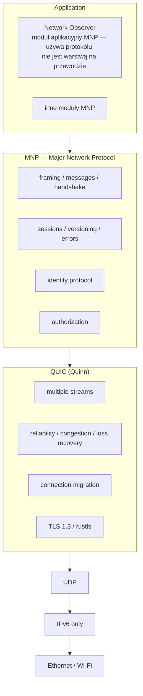
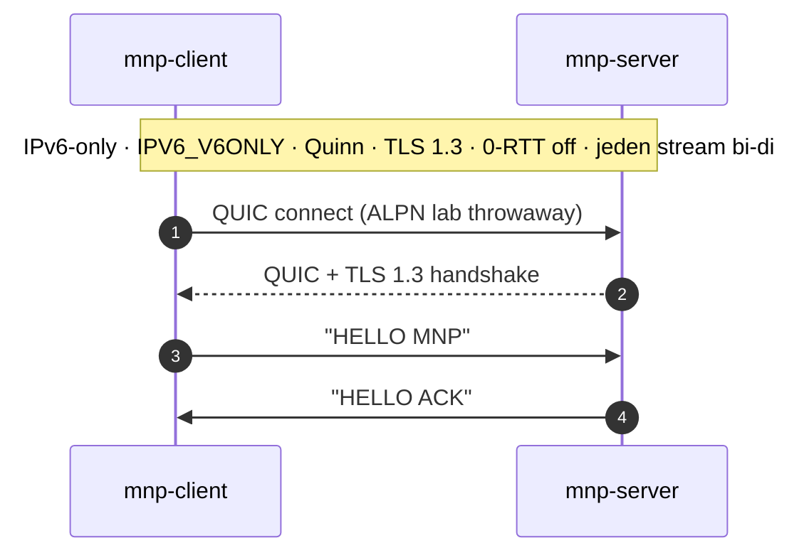
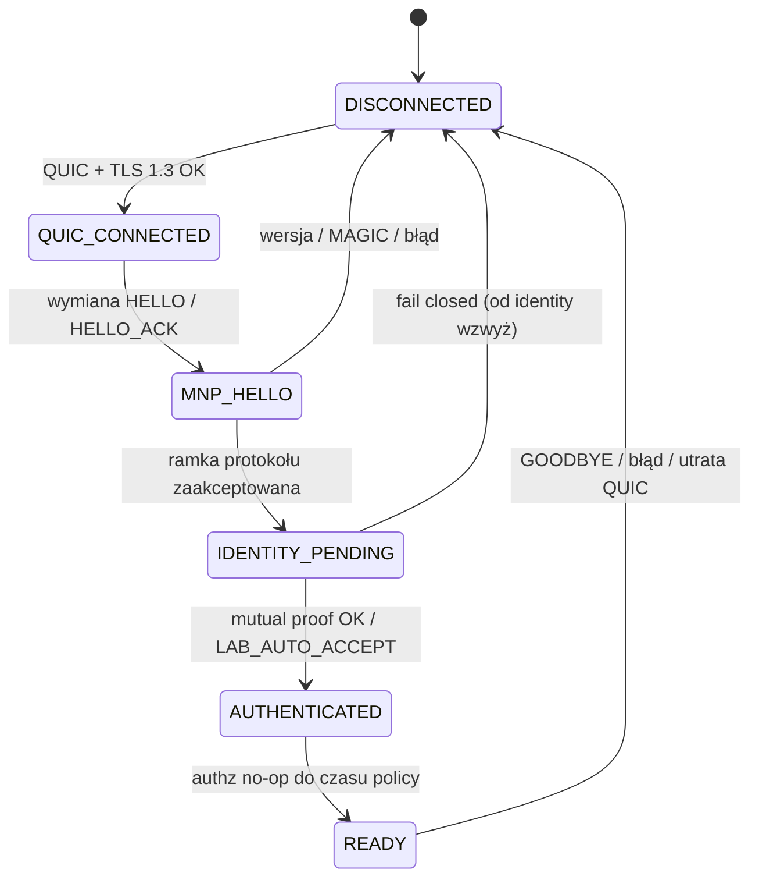

# Major Network Protocol / Major Network Stack (MNP) — Architecture v1

| Pole | Wartość |
|------|---------|
| **Tytuł** | Major Network Protocol (MNP) / Major Network Stack — Architecture v1 |
| **Autor / właściciel** | Major |
| **Data** | 2026-09-10 |
| **Status** | Draft |
| **Licencja repo** | PR 1: Apache-2.0 jako tymczasowy default laboratoryjny (potwierdzone przez użytkownika). Decyzja prawna **nie** jest zamknięta (OQ 16). |
| **Zakres produktu** | **Nie jest częścią Forge V2.5.** To samodzielny projekt sieciowy. Forge pozostaje ewentualnym *konsumentem* MNP w przyszłości, nie jego domem. |
| **Lokalizacja tego pliku** | `major-network/docs/ARCHITECTURE.md` (folder roboczy MNP). Starsza kopia: `docs/mnp/DESIGN.md`. Docelowo osobne repo `major-network/`. |
| **Język** | Polski; identyfikatory, nazwy crate’ów, komunikatów i API po angielsku (`MNP`, `Quinn`, `mnp-core`, `HELLO`, …) |
| **Źródło prawdy** | Zamknięte decyzje z końca czatu [Major's Protocol](https://chatgpt.com/share/6aa31c30-0d00-83eb-b4f0-1633b01a20bd). Wcześniejsze warianty (Python + `aioquic`, TCP-first, dual-stack jako default) są **odrzucone** i nie obowiązują. |

Ten dokument **nie zamyka** niczego, czego czat nie zamknął — z wyjątkiem decyzji użytkownika spisanych tu jako KD 18 (MNP nie jest VPN-em) oraz potwierdzeń OQ 6 / 16 / 17. Pozostałe luki są w [Open Questions](#open-questions). Stałe laboratoryjne (certyfikat TLS, `MAGIC`, ALPN) są **throwaway** i nie precedensem dla v1 produkcyjnego.

---

## Overview

MNP (Major Network Protocol) to prywatna, wzajemnie uwierzytelniona warstwa komunikacji między własnymi, zaufanymi urządzeniami właściciela — na dziś MacBook i Fedora/workstation, później VM/Forge i router. To nie jest protokół publicznego internetu i nie jest własnym RDP.

Wartość nie leży w samym fakcie „mam protokół”. Świat ma protokołów pod dostatkiem. Wartość MNP to model relacji i kontroli dostępu:

```text
HUMAN  →  DEVICE  →  PEER (router/server)
```

plus — *później*, poza v1 — kontrolowany dostęp do istniejących usług (`RDP` / `VNC` / `SSH`) przez MNP. MNP nie reimplementuje pulpitu zdalnego; decyduje *kto, z jakiego urządzenia, do jakiego peera/usługi* może się dostać. Istniejący protokół wykonuje wyspecjalizowaną robotę.

Architecture v1 jest zamknięta technologicznie. Poniższy stos jest **kanoniczny**: identity i authorization żyją *wewnątrz* MNP, nad QUIC — nie jako osobna warstwa między MNP a Quinn.

```text
Application (Network Observer jako moduł aplikacyjny MNP + inne moduły)
        ↓
MNP (framing, messages, handshake, sessions, versioning,
     identity protocol, authorization)
        ↓
QUIC (Quinn): streams, reliability, congestion, loss recovery, connection migration, TLS 1.3
        ↓
UDP → IPv6 only → Ethernet / Wi-Fi
```

Network Observer jest **modułem aplikacyjnym MNP**: używa protokołu do raportowania, nie jest czwartą warstwą na przewodzie. Crate (osobny vs. `mnp-core`) zostaje w Open Questions.

QUIC wozi. MNP mówi *co* i *kto ma prawo*. Implementacja: **Rust + Tokio + Quinn**, TLS 1.3/`rustls`, IPv6-only. Pierwszy spike (`v0.0.1`) to dwa procesy i `HELLO MNP` → `HELLO ACK` po jednym strumieniu dwukierunkowym — bez identity, bez Observera, bez własnego framingu.

---

## Background & Motivation

### Problem

Właściciel ma kilka zaufanych maszyn (MacBook, Fedora/workstation, później VM i router) i chce między nimi prywatnego kanału, w którym obie strony wiedzą, *z kim* rozmawiają: nie tylko „jest użytkownik X”, ale „człowiek H na urządzeniu D łączy się z peerem P”. Numer seryjny, MAC i model sprzętu są metadanymi, nie dowodem tożsamości.

Obecny stan: nie ma osobnego repo, crate’ów ani działającego połączenia. Jest zamknięta Architecture v1 z czatu i ten dokument. Workspace, w którym leży kopia robocza, to Forge V2.5 — produkt orkiestracji labów — i **nie** jest miejscem implementacji MNP.

### Ból, którego MNP *nie* leczy w v1

- publiczny internet i NAT traversal jako produkt,
- własny protokół pulpitu,
- „bezpieczeństwo przez nieznany format” (łamanie Kerckhoffsa),
- dual-stack / IPv4 jako domyślna ścieżka.
- bycie overlay VPN w stylu WireGuard/Tailscale.

MNP **nie jest VPN-em** (KD 18): to protokół aplikacyjny / identity-aware access layer, nie overlay.

### Dlaczego teraz dokument, a nie kod

Forge 2.5 ma priorytet produktowy. Równoległe „maksowanie” dwóch dużych implementacji było świadomie odrzucone. Ten task jest wyłącznie dokumentacją. Implementacja ruszy w osobnym repo `major-network/`, warstwa po warstwie, od `HELLO → ACK`.

---

## Goals & Non-Goals

### Goals (Architecture v1)

1. **Prywatny kanał między zaufanymi urządzeniami** z wzajemnym uwierzytelnieniem (mutual auth) w modelu human + device + peer.
2. **Czysty podział warstw:** QUIC (Quinn) = transport, niezawodność, congestion, loss recovery, connection migration, TLS 1.3. MNP = framing, semantyka wiadomości, handshake aplikacyjny, sesje logiczne, identity, autoryzacja, wersjonowanie.
3. **Jedna wspólna biblioteka protokołu** (`mnp-core`) — parser i maszyna stanów nie są implementowane osobno w kliencie i serwerze.
4. **IPv6-only w v1**, bo upraszcza model zamkniętego zestawu urządzeń, nie dlatego, że IPv6 jest „bezpieczniejsze”.
5. **Tożsamość kryptograficzna, nie inwentarzowa.** Klucz urządzenia / peera / człowieka; serial/MAC tylko jako metadata.
6. **Hardware-backed identity jako założenie architektoniczne** (Nitrokey 3A Mini): klucz prywatny nie opuszcza tokena. Token *nie* jest pierwszym spike’iem.
7. **Kerckhoffs:** przeciwnik zna format, handshake i kod. Tajne są klucze, nie konstrukcja.
8. **Przyrostowa implementacja** w osobnym repo, od najgłupszego działającego QUIC do identity i Observera. Styl pracy: warstwa → po co → abstrakcja → kod → test → rozbiór (Quinn / QUIC / UDP / IPv6).

### Non-goals v1

- IPv4 i Happy Eyeballs (dopiero późniejszy compatibility mode, jeśli kiedykolwiek).
- Dual-stack jako default.
- Własny RDP / VNC / SSH; reimplementacja pulpitu.
- Własne algorytmy kryptograficzne na ścieżce bezpieczeństwa.
- MCE (Major Crypto Experiment) na ścieżce produkcyjnej.
- MTP (Major Transport Protocol) jako transport v1.
- Biometria w pierwszym milestone (fingerprint/face/liveness = research; iris odłożone).
- Nitrokey w spike’u `v0.0.1`.
- Wkładanie MNP do repo Forge (`crates/`, `Cargo.toml`, dokumentacja produktowa Forge).
- Równoległa duża implementacja MNP obok Forge 2.5 (ten task = tylko dokument).
- Publiczny internet jako domena operacyjna.
- Platforma metryk / SaaS feature flags.

---

## Proposed Design

### Stos v1 (zamknięty)

Diagram mermaid jest **kanoniczny**. Identity protocol i authorization są *w* MNP, nad QUIC.



Skrót (ta sama semantyka; **nie** osobny hop identity między MNP a QUIC):

```text
Network Observer   ← moduł aplikacyjny; używa MNP
          ↓
         MNP       ← zawiera identity + authorization
          ↓
         QUIC (Quinn)
          ↓
       TLS 1.3
          ↓
         UDP
          ↓
        IPv6
```

### Granica odpowiedzialności

| Warstwa | Robi | Nie robi |
|---------|------|----------|
| **MNP** | semantyka komunikatów; *co* to za wiadomość; *kto* (human/device/peer); *czy ma prawo*; sesja logiczna; wersja protokołu; błędy aplikacyjne | congestion control, loss recovery, TLS, connection migration, multipleksowanie strumieni na poziomie UDP |
| **QUIC (Quinn)** | wozi bajty; strumienie niezależne od strat na innych strumieniach; TLS 1.3; migracja ścieżki (Connection ID); niezawodność per-stream | decyzje autoryzacyjne MNP; model tożsamości człowieka/urządzenia |
| **TLS 1.3 / rustls** | poufność i integralność *transportu* QUIC | dowód „jestem tym człowiekiem / tym urządzeniem / tym peerem” w sensie MNP |
| **Nitrokey** | proof-of-possession; klucz prywatny nie opuszcza tokena; podpis challenge’u | async runtime; szyfrowanie bulk traffic |
| **Tokio** | koordynacja zadań async (QUIC client/server/Observer, timery, I/O) | przechowywanie kluczy; identity |

MNP nie reimplementuje congestion, loss recovery, TLS ani connection migration. Protokół aplikacyjny oparty wprost na UDP musiałby rozwiązać przeciążenie sam — to jeden z powodów, dla których v1 stoi na QUIC.

### Tokio ≠ Nitrokey

To dwa różne problemy. Mylenie ich było w czacie skorygowane i zostaje skorygowane tutaj.

```text
Tokio                          Nitrokey 3A Mini
│                              │
├── async runtime              ├── przechowywanie klucza
├── wiele operacji sieciowych  ├── operacje kryptograficzne (podpis)
├── czekanie na QUIC / I/O     ├── proof-of-possession
└── zadania współbieżne        └── fizyczny element tożsamości
```

Tokio koordynuje m.in.:

```text
                 TOKIO
                   │
      ┌────────────┼────────────┐
      ▼            ▼            ▼
 QUIC client    QUIC server   Observer
      │            │            │
      ▼            ▼            ▼
 stream IDENTITY client #2     events
 stream DATA     client #3     network
 stream CONTROL  client #4     timers
```

Nazwy strumieni w tym rysunku to zamknięte nazwy logiczne (`IDENTITY` / `CONTROL` / `DATA`), nie numery QUIC.

Nitrokey *nie* zastępuje Tokio. Szyfrowanie całego ruchu przez token jest **odrzucone**: bulk crypto zostaje w TLS 1.3/QUIC. Token podpisuje tożsamość.

### IPv6-only — uzasadnienie (zamknięte)

IPv6-only jest decyzją v1, ponieważ upraszcza model zamkniętego zestawu zaufanych urządzeń, a nie dlatego, że IPv6 jest z definicji bezpieczniejsze. Firewall, polityka dostępu i uwierzytelnienie i tak są konieczne.

Happy Eyeballs / IPv4 to najwyżej późniejszy compatibility mode. Dual-stack jako default został odrzucony.

QUIC działa nad UDP i nie jest związany z IPv4; wiązanie v1 to `IPv6` na gnieździe (`[::]` / adresy IPv6), nie „QUIC magicznie wymaga szóstki”.

**Egzekwowanie w labie (v0.0.1 / PR 2):** gniazdo z `IPV6_V6ONLY` (lub równoważnikiem Quinn/OS). Odrzucać peerów z adresem IPv4-mapped (`:ffff:`). To nie zmienia decyzji sieciowej; zapobiega przypadkowemu IPv4 na hoście, gdzie dual-stack socket połyka mapped addresses.

### QUIC: po co nam wiele strumieni i Connection ID

**Head-of-line (HOL).** Jedno połączenie TCP to jeden uporządkowany strumień bajtów. Utrata segmentu wstrzymuje *cały* strumień. Jedno połączenie QUIC ma wiele niezależnych strumieni: strata na `FILES`/`DATA` nie powinna blokować `CONTROL` ani `OBSERVER`. To analogia do powodu, dla którego HTTP/3 zastąpił HTTP/2-over-TCP.

**Connection migration.** Connection ID nie jest o „mniejszej liczbie strat pakietów”. Chodzi o **nieutracenie stanu logicznego połączenia przy zmianie ścieżki sieciowej** (przykład z czatu: telefon Wi-Fi → cellular). Klasyczne TCP identyfikuje przepływ krotką adresów/portów; zmiana ścieżki zwykle zabija połączenie. QUIC weryfikuje nową ścieżkę i kontynuuje to samo połączenie.

### Identity — model (zamknięty), crypto (TBD)

Trójkąt zaufania — **trzy** pryncypia kryptograficzne, nie cztery:

```text
          HUMAN
            │
            ▼
         DEVICE
            │
            ▼
          PEER
     np. ROUTER / SERVER
```

Przykład (etykiety, nie dowód):

```text
Human:   Major
Device:  Workstation-Fedora-01
Peer:    Router-MNP-01
```

```text
MNP Identity (pryncypia)
├── HumanIdentity
├── DeviceIdentity
└── PeerIdentity
```

`SESSION` (8 B w ramce) i `SessionState` to **uchwyt sesji logicznej**, nie czwarte pryncypium i nie klucz sesyjny MNP. Szyfrowanie transportu zostaje w TLS 1.3. Czy potrzebny jest osobny, kryptograficznie wyprowadzony identyfikator sesji — Open Question, nie obiekt w drzewie tożsamości.

| Tożsamość | Dowód | Nie-dowód |
|-----------|-------|-----------|
| **Human** | token (Nitrokey) + *research:* fingerprint / face / liveness; iris **odłożone** | hasło w pliku jako jedyny czynnik; biometria wysłana w sieci jako sekret |
| **Device** | własny klucz urządzenia | numer seryjny, MAC, model |
| **Peer** | własny klucz peera (np. router) | nazwa hosta, adres IPv6 |

Biometria **nie jest sekretem sieciowym**. Lokalnie odblokowuje tożsamość kryptograficzną (coś, co masz + coś, czym jesteś + ewentualnie PIN). Szablon biometryczny nie jest hasłem i nie jest przesyłany jako dowód MNP.

Dwa poziomy kryptografii (zamknięte jako *podział*, nie jako algorytmy):

```text
TLS 1.3
└── chroni transport QUIC

MNP Identity Crypto
└── udowadnia tożsamość człowieka / urządzenia / peera
```

Własny **protokół** identity projektujemy. Własnych **algorytmów** na ścieżce bezpieczeństwa nie wymyślamy. Algorytm (Ed25519 vs. cokolwiek innego) wybiera się *po* modelu zagrożeń — dziś TBD; zamyka to osobny PR dokumentacyjny (patrz PR Plan), nie ten dokument.

MCE (Major Crypto Experiment) to osobny tor edukacyjny z etykietą **NOT FOR SECURITY**. Produkcyjny MNP używa sprawdzonej kryptografii. MCE można później celowo łamać.

### Docelowy flow identity (po spike’u, nie w v0.0.1)

Szkic zamknięty w czacie — **nie** specyfikacja wiadomości binarnych. Dokładna sekwencja (`CHALLENGE` vs. `SERVER_ID` / `DEVICE_ID`) zostaje w Open Questions, aż PR dokumentacyjny identity ją spisze.

```mermaid
sequenceDiagram
    autonumber
    participant MB as MacBook / client
    participant NK as Nitrokey 3A Mini
    participant FD as Fedora / peer
    MB->>FD: HELLO
    FD->>MB: CHALLENGE
    MB->>NK: podpisz challenge
    NK-->>MB: SIGNED PROOF<br/>(klucz prywatny nie opuszcza tokena)
    MB->>FD: SIGNED PROOF
    FD->>MB: AUTHENTICATED
    Note over MB,FD: Tokio cały czas obsługuje QUIC; token tylko podpisuje tożsamość
```

Komunikacja ma być **mutually authenticated**: klient potwierdza serwer/router, router potwierdza klienta.

Kolejność dokładania warstw (zamknięta):

```text
połączenie (QUIC/IPv6)
    → protokół (HELLO / framing)
    → maszyna stanów (z LAB_AUTO_ACCEPT w labie)
    → specyfikacja identity (dokument, zanim kod)
    → identity (najpierw software keys)
    → hardware token (Nitrokey)
    → Observer
    → Service Access  (poza v1)
```

### Strumienie logiczne (nazwy, nie numery)

Jedna sesja MNP **docelowo** korzysta z kilku logicznych kanałów nad **jednym** połączeniem QUIC:

```text
ONE QUIC CONNECTION
│
├── CONTROL
├── IDENTITY
├── OBSERVER
├── EVENTS
├── DATA
└── FILES          (później)
+ opcjonalne datagramy QUIC
```

Numery streamów z wcześniejszych diagramów (`0 / 4 / 8 / 12 / 16`) to **szkic, nie specyfikacja**. Przypisanie `CONTROL` → konkretny stream ID zostaje w Open Questions.

**Do końca implementacji identity (PR software-key mutual auth) wszystkie wiadomości MNP jadą po jednym strumieniu dwukierunkowym ze spike’u.** Rozdział na nazwane strumienie nie wchodzi „przy okazji” framingu. Pierwszym PR-em, który otwiera *drugi* strumień, jest Observer MVP (`OBSERVER`); ten PR dodaje też minimalny helper „otwórz nazwany strumień logiczny” bez pinowania numerów. `CONTROL` / `IDENTITY` / `DATA` mogą do tego momentu pozostać rolami na oryginalnym strumieniu.

### Network Observer (wstępnie, zakres **nie zamrożony**)

Observer jest **modułem aplikacyjnym MNP**: zbiera stan hosta i raportuje go *przez* MNP, nie stanowi osobnej warstwy protokołu i nie jest chaotycznym skanerem sieci. Czy to osobny crate, czy moduł `mnp-core` — Open Questions.

Wstępny zakres z czatu (do późniejszego zawężenia lub rozszerzenia):

```text
Network Observer
├── host state
├── interfaces
├── IPv6 addresses
├── routes
├── connections
├── DNS
├── neighbors
├── events
└── podstawowe observations / anomalies
```

Ścieżka raportu:

```text
Observer → wiadomość MNP → QUIC stream (OBSERVER) → zaufany, uwierzytelniony endpoint
```

MVP (gdy przyjdzie kolej) zaczyna od małego zestawu, np. hostname, OS, adresy IPv6, interfejsy, uptime — nie od pełnego audytu. To nie jest zamknięta specyfikacja zakresu. Observer **wymaga** wcześniejszego software mutual auth: raport tylko do peera, który przeszedł identity. Nitrokey nie jest twardym wymaganiem wstępnym Observer MVP.

### Service Access / VM Access (future use case, **poza v1**)

Docelowy obraz — *nie* zakres v1:

```text
MACBOOK
   │
   │ MNP / QUIC / IPv6
   ▼
WORKSTATION
   ├── Observer
   ├── Forge          ← konsument MNP, nie host protokołu
   ├── VM Fedora
   ├── VM Windows
   └── inne usługi
```

Model dostępu:

```text
RDP / VNC / SSH / inna usługa
              ↓
        MNP-controlled access
              ↓
             QUIC
              ↓
            IPv6
```

MNP = identity-aware access control. RDP/VNC/SSH = faktyczny pulpit/sesja. Szczegóły policy/authorization są otwarte.

### Repo i crate’y (przyszłe `major-network/`, nie Forge)

```text
major-network/
├── crates/
│   ├── mnp-core/       # wspólna biblioteka: typy, framing, stan, identity
│   ├── mnp-client/
│   └── mnp-server/
├── docs/
│   ├── ARCHITECTURE.md
│   └── PROTOCOL.md
└── Cargo.toml          # workspace
```

`mnp-core` jest jedynym miejscem parsera protokołu. Client i server linkują core; nie duplikują ramek ani maszyny stanów.

**Topologia v0.0.x (potwierdzona):** `mnp-client` inicjuje, `mnp-server` akceptuje. To lab dwóch procesów, nie docelowy model ról. MacBook ↔ Fedora to oba *urządzenia*; symetryczny accept/initiate zostaje na później (OQ 17). Discovery peera — osobne Open Question.

Ten dokument, po starcie repo, żyje jako `major-network/docs/` (np. ten plik lub jego następca `ARCHITECTURE.md`). **Żadnego** z tych crate’ów nie dodajemy do workspace Forge.

### Wersje protokołu laboratoryjnego (jedno miejsce)

| Wersja | Znaczenie | PR |
|--------|-----------|-----|
| **v0.0.1** | surowy `HELLO MNP` / `HELLO ACK` na jednym strumieniu bi-di, QUIC/IPv6, bez framingu | PR 2 |
| **v0.0.2** | binarna ramka + cztery typy na przewodzie; sesja żyje do `GOODBYE` / teardown QUIC | PR 3 |
| **v0.0.3** | maszyna stanów `DISCONNECTED→READY` z domyślnym `LAB_AUTO_ACCEPT` | PR 4 |
| *(bez numeru wire)* | specyfikacja identity, potem typy, potem software mutual auth (fail closed) | PR 5–7 |

v0.0.2 **nie** zawiera maszyny stanów. v0.0.3 **nie** zawiera prawdziwego identity.

### Milestone v0.0.1 — Technology Spike 01

Cel: udowodnić kręgosłup, nie protokół.



Warunki zaliczenia:

| Wymagane | Zakazane w v0.0.1 |
|----------|-------------------|
| Rust, Tokio, Quinn | identity |
| QUIC, TLS 1.3 | Observer |
| IPv6 only + `IPV6_V6ONLY` | biometria |
| jeden bidirectional stream | własny framing |
| dwa procesy (najpierw localhost) | własne crypto |
| 0-RTT wyłączone | IPv4 / IPv4-mapped |
| throwaway lab TLS (poniżej) | `SkipServerVerification` jako „tożsamość” |

#### Lab-only TLS (nie precedens produkcyjny)

Schemat certyfikatów v1 **pozostaje otwarty** (Open Questions). Spike musi jednak zestawić Quinn. Kontrakt laboratoryjny:

1. Przy starcie procesu serwer generuje throwaway self-signed cert (lub jednorazowe mini-CA). Crate do mintowania: `rcgen` albo równoważnik — wybór w PR 2, nie tu.
2. Quinn `ServerConfig` używa wyłącznie tego materiału.
3. Klient **ufą tylko temu** wygenerowanemu materiałowi (pin certu / tymczasowego CA przekazanego out-of-band, np. plik obok obu binarek albo stdout serwera). To *nie* jest MNP identity.
4. **Zakaz** `SkipServerVerification` / równoważnego „ufaj każdemu” na ścieżce, którą dałoby się pomylić z dowodem tożsamości MNP.
5. Provider kryptograficzny rustls (`ring` / `aws-lc-rs`) — wybór w PR 2 wraz z wersją Quinn; Architecture v1 go nie pinuje.
6. ALPN laboratoryjny, throwaway, zapisany w `docs/PROTOCOL.md` jako nie-kontrakt, np. `mnp-lab/0`. Produkcyjny token ALPN zostaje otwarty.
7. **0-RTT wyłączone** aż wiązanie identity z sesją QUIC/TLS zostanie spisane.

Ten przepis nie zamyka OQ o certyfikatach produkcyjnych.

#### Sekwencja wywołań (ilustracja, nie kontrakt API Quinn)

Szkic **nie** jest wersją-dokładnym `main`. Quinn 0.11-era wymaga m.in. zainstalowanego `CryptoProvider` i ma inne typy `Incoming` / `finish()`. PR 2 dopasowuje się do wybranej wersji.

```text
server:
  bind IPv6 [::1]:4433 with IPV6_V6ONLY
  mint throwaway cert → ServerConfig (ALPN mnp-lab/0, 0-RTT off)
  Endpoint::server
  accept → await connection
  accept_bi
  read  "HELLO MNP"
  write "HELLO ACK"
  (v0.0.1 MAY finish the send stream — one-shot spike)

client:
  bind IPv6 [::]:0 with IPV6_V6ONLY
  ClientConfig trusts only the lab cert (no skip-verify)
  connect [::1]:4433
  open_bi
  write "HELLO MNP"
  read  "HELLO ACK"
```

Po zaliczeniu: rozbiór ścieżki `funkcja Rust → Quinn → QUIC → UDP → IPv6 → interfejs`. Nie 10k LOC pierwszego dnia.

Późniejszy lab: dwa rzeczywiste endpointy (Fedora ↔ Mac) zamiast samego localhost — prawdziwy handshake, zmiana interfejsu, zerwanie. Nie blokuje v0.0.1.

### Milestone v0.0.2 — ramka na przewodzie (bez maszyny stanów)

Tekst `"HELLO MNP"` znika. Pierwsza binarna ramka (szkic z czatu). Poniższe stałe są **laboratoryjne, nie kontrakt v1**; produkcyjny layout zostaje w Open Questions.

```text
MNP HEADER                          lab throwaway
MAGIC       4 B                     b"MNP1"
VERSION     1 B                     0
TYPE        1 B
FLAGS       2 B                     0
LENGTH      4 B                     rozmiar PAYLOAD, little-endian;
                                    lab max 64 KiB (throwaway)
SESSION     8 B                     little-endian; zawsze 0 przez v0.0.3
                                    (alokacja ID = OQ 11, nie w tym DESIGN)
----------------
PAYLOAD     N B
```

```text
+--------+---------+------+-------+---------+----------+
| MAGIC  | VERSION | TYPE | FLAGS | LENGTH  | SESSION  |
+--------+---------+------+-------+---------+----------+
|                      PAYLOAD                         |
+------------------------------------------------------+
```

Suma pól nagłówka ze szkicu: 20 B. Endianness, `MAGIC`, semantyka `LENGTH` i bity `FLAGS` **nie są zamknięte** jako specyfikacja — tylko jako wartości, bez których PR 3 nie skompiluje parsera. Zmiana tych stałych przed „v1 wire” nie łamie Architecture v1.

**Lab-only cap `LENGTH` (throwaway, nie kontrakt v1):** `LAB_MAX_PAYLOAD = 65_536` (64 KiB). Parser **nie** alokuje `vec![0; length as usize]` bez sprawdzenia. Jeśli `LENGTH > LAB_MAX_PAYLOAD`: nie czytać payloadu, wysłać `ERROR` jeśli da się to zrobić bez dalszej alokacji, potem disconnect. Limit produkcyjny zostaje w Open Questions §4.

**`SESSION` przez v0.0.3:** pole obecne w ramce, wartość **zawsze `0`**. v0.0.3 nie nadaje identyfikatorów sesji i nie zamyka OQ 11. Żadnego allocatora w tym dokumencie.

Pierwsze typy — **tylko cztery**, bez trzydziestu opcode’ów:

| TYPE | Nazwa |
|------|--------|
| `0x01` | `HELLO` |
| `0x02` | `HELLO_ACK` |
| `0x03` | `ERROR` |
| `0x04` | `GOODBYE` |

Typy identity / Observer pojawią się *później*, gdy te warstwy wejdą do implementacji. Nie rezerwujemy tu puli.

**Życie strumienia w v0.0.2:** nie wołać `finish()` po `HELLO`. Czytać ramki w pętli: 20 B nagłówka; jeśli `LENGTH` jest w limicie labowym, potem `LENGTH` bajtów payloadu; w przeciwnym razie `ERROR`/disconnect. Zamykać przez `GOODBYE` albo teardown QUIC. Nadal **jeden** strumień bi-di. `SESSION` = 0.

### Milestone v0.0.3 — maszyna stanów + `LAB_AUTO_ACCEPT`

Maszyna stanów sesji (zamknięty szkic stanów):



#### Predykaty `AUTHENTICATED` vs `READY`

| Stan | Znaczenie |
|------|-----------|
| `AUTHENTICATED` | dowody tożsamości przyjęte (albo, w v0.0.3, stand-in `LAB_AUTO_ACCEPT`) |
| `READY` | sesja logiczna może używać nie-identity ról (`CONTROL` / `OBSERVER` / `DATA`) |

**Potwierdzone przez użytkownika:** oba stany zostają; **nie** scalamy ich. Przejście `AUTHENTICATED → READY` jest **no-op** (natychmiastowe, bez dodatkowego checku) aż do policy w PR 10. OQ 6 dotyczy wyłącznie chwili, gdy policy wejdzie i no-op może przestać obowiązywać.

#### Kontrakt labowy przed identity (opcja A)

W v0.0.3 **domyślnie** włączony jest jawny tryb `LAB_AUTO_ACCEPT`:

```text
HELLO / HELLO_ACK OK
    → IDENTITY_PENDING
    → AUTHENTICATED     (bez krypto; log: lab_auto_accept=true)
    → READY             (no-op authz)
```

Dzięki temu maszyna jest wykonywalna i `READY` jest osiągalne po HELLO — zgodnie z czatem (`IDENTITY_PENDING → AUTO ACCEPT`, żeby nie blokować rozwoju). Nazwa jest celowo brzydka, logowana, nie mylona z mutual auth.

**Przed / w PR software-key mutual auth:** `LAB_AUTO_ACCEPT` znika jako default. Od tego momentu obowiązuje **fail closed**: brak dowodu ⇒ brak `AUTHENTICATED` / `READY`. To jest zachowanie v1 identity, nie v0.0.3.

0-RTT nadal wyłączone.

### Skala i cele laboratoryjne (nie SaaS)

| Wielkość | Oczekiwanie v1 |
|----------|----------------|
| Liczba urządzeń | pojedyncze sztuki (MacBook, Fedora, później router/VM) |
| Domena | LAN / lab, nie publiczny internet |
| Procesy na starcie | dwa (`mnp-client`, `mnp-server`), najpierw localhost IPv6 |
| RTT | LAN / Wi-Fi; brak SLA produktowego |
| Przepustowość | nie jest celem v0.0.x; QUIC niesie congestion control, gdy pojawią się `DATA`/`FILES` |
| Przechowywanie | brak bazy; stan sesji in-memory |

### Styl pracy (zamknięty jako proces)

Przy każdej warstwie:

1. Co budujemy?
2. Na której warstwie stosu jesteśmy?
3. Dlaczego tego potrzebujemy?
4. Jak działa używana abstrakcja?
5. Dopiero wtedy kod.
6. Test.
7. Rozbieramy wynik (Quinn / QUIC / UDP / IPv6).

---

## API / Interface Changes

To nowy projekt. Nie ma publicznego API do łamania. Poniższe interfejsy są **szkicem kierunku** dla `mnp-core`; nie zamykają layoutu binarnego poza laboratoryjną ramką v0.0.2 ani API Nitrokey.

### Crate’y

| Crate | Rola |
|-------|------|
| `mnp-core` | typy wiadomości; od v0.0.2 encode/decode ramki; od v0.0.3 maszyna stanów; później identity protocol |
| `mnp-client` | Quinn client, IPv6, CLI laboratoryjne; w v0.0.x **inicjuje** |
| `mnp-server` | Quinn server, bind wyłącznie IPv6 + `IPV6_V6ONLY`, accept loop; w v0.0.x **akceptuje** |

### Szkic typów `mnp-core` (v0.0.2 / v0.0.3)

```rust
/// Laboratoryjne, nie kontrakt v1. Zob. Open Questions (layout).
pub const LAB_MAGIC: [u8; 4] = *b"MNP1";
pub const LAB_VERSION: u8 = 0;
pub const HEADER_LEN: usize = 20; // 4+1+1+2+4+8 ze szkicu ramki
pub const LAB_MAX_PAYLOAD: u32 = 65_536; // 64 KiB, throwaway; v1 max = OQ 4

#[repr(u8)]
pub enum MessageType {
    Hello    = 0x01,
    HelloAck = 0x02,
    Error    = 0x03,
    Goodbye  = 0x04,
}

pub struct FrameHeader {
    pub magic:   [u8; 4],
    pub version: u8,
    pub ty:      u8,
    pub flags:   u16,
    pub length:  u32, // lab: bajty PAYLOAD, LE; reject if > LAB_MAX_PAYLOAD
    pub session: u64, // uchwyt; przez v0.0.3 zawsze 0; nie pryncypium
}

pub enum SessionState {
    Disconnected,
    QuicConnected,
    MnpHello,
    IdentityPending,
    Authenticated,
    Ready,
}
```

Parser żyje tylko w `mnp-core`. Testy ramek (happy path, za krótki nagłówek, zły `TYPE`, zerwany stream) idą z core, nie z binarek.

### Quinn / TLS

- Server: bind IPv6 + `IPV6_V6ONLY`.
- Client: bind IPv6 + `IPV6_V6ONLY`; ufa wyłącznie lab cert.
- Jeden `open_bi` / `accept_bi` od v0.0.1 aż do PR Observera (drugi strumień).
- ALPN lab: throwaway `mnp-lab/0` (nie kontrakt).
- 0-RTT: off.
- Certyfikaty produkcyjne Quinn: **TBD** (Open Questions). Lab: przepis powyżej.

### Identity API (nie w v0.0.1–v0.0.3)

Docelowo adapter — po specyfikacji (PR dokumentacyjny) i po typach:

```text
IdentityBackend
├── SoftwareKeys        // po specyfikacji i typach, przed sprzętem
└── HardwareToken       // Nitrokey 3A Mini — po software keys
        └── konkretne API (PIV / OpenPGP / FIDO2) = TBD
```

Nie wybieramy interfejsu kryptograficznego Nitrokey 3A Mini bez sprawdzenia aktualnych możliwości urządzenia. Typy kryptograficzne to `HumanIdentity` / `DeviceIdentity` / `PeerIdentity`, nie „SessionIdentity”.

---

## Data Model Changes

Brak bazy danych w v1. Stan jest procesowy.

### Sesja logiczna MNP

| Pole | Uwagi |
|------|--------|
| `session` (8 B w ramce) | uchwyt w nagłówku v0.0.2; **nie** czwarte pryncypium; przez v0.0.3 zawsze `0`; alokacja / relacja do QUIC Connection ID — OQ 11 |
| `SessionState` | maszyna v0.0.3 |
| `HumanIdentity` / `DeviceIdentity` / `PeerIdentity` | jedyne pryncypia; puste do warstwy identity |
| uchwyt połączenia Quinn | transport; migracja ścieżki jest sprawą QUIC |
| `lab_auto_accept` | bool; default `true` w v0.0.3; usuwany jako default przy software mutual auth |

Serial / MAC / model mogą wisieć jako metadata przy `DeviceIdentity`, nigdy jako substytut klucza.

### Wiadomości v0.0.2

Tylko `HELLO`, `HELLO_ACK`, `ERROR`, `GOODBYE`. Payload `HELLO`/`ACK` na tym etapie może być pusty albo minimalny; **nie zamykamy** TLV ani wersjonowania payloadu.

### Migracja danych

Nie dotyczy. Zielone pole. Gdy pojawi się trwała tożsamość (pliki kluczy, później token), format store’u będzie osobną decyzją — dziś otwartą.

---

## Alternatives Considered

Wszystkie poniższe były rozważane w czacie i **odrzucone** dla v1. Nie wracamy do nich, dopóki praktyka nie pokaże konkretnego problemu.

### 1. Python + `aioquic` jako rdzeń

- **Za:** szybki prototyp, niski próg wejścia.
- **Przeciw:** MNP chce kontroli bajtów, buforów i async transportu blisko sieci; Python zostaje przy Crypto Lab / analizie, nie przy rdzeniu.
- **Werdykt:** odrzucone. Rust + Quinn.

### 2. C/C++ (w tym MsQuic)

- **Za:** maksymalny low-level, dojrzały MsQuic (streams, 0-RTT, migration).
- **Przeciw:** koszt bezpieczeństwa pamięci i ciężar infrastruktury przy jednoosobowym projekcie edukacyjno-labowym.
- **Werdykt:** odrzucone jako rdzeń v1.

### 3. Go + quic-go

- **Za:** najprostszy konkurent „mieć działający MNP szybko”; RFC 9000/9001/9002.
- **Przeciw:** celem jest też *zrozumienie*; Rust jest lepszym kompromisem low-level vs. bezpieczeństwo pamięci.
- **Werdykt:** nie wybrany. Ranking czatu pod ten projekt: Quinn > quic-go > quiche > MsQuic > Python.

### 4. Rust + Cloudflare quiche

- **Za:** bardzo niskopoziomowy QUIC/HTTP3, własne I/O i timery.
- **Przeciw:** więcej infrastruktury, której v1 nie potrzebuje. Quinn daje async API na Tokio „z pudełka”.
- **Werdykt:** nie na v1.

### 5. TCP jako transport v1

- **Za:** wszechobecność, prostota mentalna, NAT.
- **Przeciw:** jeden byte stream ⇒ HOL; brak wbudowanego TLS w transporcie; brak connection migration; MNP musiałby multipleksować wiadomości w jednym strumieniu.
- **Werdykt:** **baseline / fallback**, nie primary. v1 = QUIC.

### 6. SCTP jako transport v1

- **Za:** wiadomości, wiele strumieni, multihoming (RFC 9260).
- **Przeciw:** gorsza praktyczna przechodniość NAT/firewalli niż UDP/TCP; brak TLS w projekcie protokołu; mniejsza powszechność.
- **Werdykt:** research/comparison, nie v1. Nie dlatego, że SCTP jest kiepski — QUIC rozwiązuje więcej *naszych* problemów praktycznych.

### 7. Czyste UDP / DCCP / własny MTP

- **Za:** pełna kontrola; MTP jako ekstremalny eksperyment badawczy.
- **Przeciw:** UDP nie ma congestion control; aplikacja musiałaby go dowieźć. DCCP (RFC 4340) — research. MTP = future experiment.
- **Werdykt:** v1 = QUIC. MTP nie wchodzi na ścieżkę produkcyjną.

### 8. Dual-stack / IPv4-preferred / Happy Eyeballs jako default

- **Za:** sieci bez IPv6, mniejszy lock-in labowy.
- **Przeciw:** komplikuje model v1; MNP nie jest produktem na cały internet.
- **Werdykt:** odrzucone jako default. IPv6-only v1; Happy Eyeballs najwyżej później.

Wcześniejsza propozycja `PRIMARY IPv6 + FALLBACK IPv4` / `STRICT` vs `COMPAT` **nie obowiązuje**. Została nadpisana późniejszą decyzją IPv6-only.

### 9. Numer seryjny / MAC jako tożsamość

- **Za:** proste, czytelne dla człowieka.
- **Przeciw:** można odczytać, skopiować, podszyć.
- **Werdykt:** tylko metadata.

### 10. Szyfrowanie całego ruchu przez Nitrokey

- **Za:** „wszystko w HSM”.
- **Przeciw:** token nie jest przyspieszaczem bulk AEAD; latencja i złożoność; myli identity z transport crypto.
- **Werdykt:** odrzucone. Token = identity / podpis. TLS 1.3 = ruch.

### 11. Własny RDP w MNP

- **Za:** jeden stos „od kabla do pulpitu”.
- **Przeciw:** przerost formy nad treścią.
- **Werdykt:** poza v1. MNP pilnuje dostępu; RDP/VNC/SSH robią pulpit.

### 12. Własne algorytmy krypto / MCE na pathu bezpieczeństwa

- **Za:** nauka.
- **Przeciw:** Kerckhoffs + dekady literatury. MCE dostaje etykietę edukacyjną i osobny tor.
- **Werdykt:** produkcja = sprawdzone prymitywy (wybór TBD). MCE = NOT FOR SECURITY.

### 13. Traktowanie MNP jako VPN (odrzucone)

- **Za (odrzucone):** marketingowy skrót „prywatna sieć między moimi maszynami”; analogia do WireGuard/Tailscale.
- **Przeciw:** MNP nie zestawia tunelu IP, nie routuje obcego ruchu i nie jest overlay’em. To protokół aplikacyjny z modelem human+device+peer i (później) identity-aware access control do *istniejących* usług (RDP/VNC/SSH). QUIC wozi wiadomości MNP, nie cudze pakiety IP.
- **Werdykt (zamknięte przez użytkownika):** **MNP nie jest VPN-em.** Nie porównujemy go dalej jako substytutu WireGuard/Tailscale. Key Decision 18.

---

## Security & Privacy Considerations

### Zasada Kerckhoffsa

Przeciwnik zna format ramek, handshake, ALPN, implementację i kod źródłowy. Tajne są **klucze i sekrety tożsamości**, nie konstrukcja. Złożoność formatu nie jest mechanizmem bezpieczeństwa.

### Model zagrożeń (v1, lab zaufanych urządzeń)

Zakładany atakujący *nie* jest anonimowym internetem jako domeną produktu, ale:

- kimś z dostępem do LAN / Wi-Fi (pasywny podsłuch, aktywny MITM),
- kimś ze skradzionym dyskiem laptopa,
- kimś ze skradzionym tokenem,
- oprogramowaniem na hoście próbującym użyć cudzej sesji.

| Zagrożenie | Ważność | Status obrony w Architecture v1 |
|------------|---------|----------------------------------|
| Pasywny podsłuch na LAN | wysoka | TLS 1.3 w QUIC (Quinn/rustls) — zamknięte |
| MITM / wstrzyknięcie peera | wysoka | mutual auth MNP (human+device+peer) — model zamknięty, protokół TBD |
| Replay starego `PROOF` | wysoka | świeży challenge-response — wymaganie zamknięte, mechanizm TBD |
| Skradziony dysk, **klucze software** | wysoka | kradzież dysku = kradzież tożsamości do czasu tokena |
| Skradziony dysk, **Nitrokey** | średnia | klucz prywatny nie opuszcza tokena; dysk nie wynosi identity |
| Skradziony token bez lokalnego odblokowania | średnia | PIN / biometria lokalnie — research, nie milestone 1 |
| Podszywanie serial/MAC | średnia | metadata only; nie są dowodem |
| HOL / DoS na CONTROL przez duży FILE | średnia (później) | osobne strumienie QUIC — model zamknięty, numery TBD |
| Wyciekanie biometrii przez sieć | wysoka jeśli kiedykolwiek | **zabronione z założenia**: biometria nie jest sekretem sieciowym |
| MCE użyte „bo nasze” na produkcji | krytyczna jeśli się zdarzy | osobny tor, etykieta NOT FOR SECURITY |
| Fail *open* przy błędzie identity | wysoka | **fail closed od software identity wzwyż**: brak dowodu ⇒ brak `READY` |
| 0-RTT replay zanim identity zwiąże sesję QUIC | średnia | **0-RTT wyłączone** w spike’u i aż do spisania bindingu |

Nie modelujemy tu (jeszcze) publicznego internetu ani formalnej analizy protokołu identity — bo protokół identity nie jest zamknięty.

### Mutual auth i fail closed

Obie strony muszą zakończyć identity z sukcesem. Nieznany peer, zła wersja, zły `MAGIC`, nieudany podpis, timeout challenge’u ⇒ zamknięcie sesji, nie tryb „i tak wpuść”.

`LAB_AUTO_ACCEPT` jest **jedyną** protezą rozwojową: default v0.0.3, zdjęty przed software mutual auth. Nie jest zachowaniem v1 po wejściu identity.

### Dysk vs. token

```text
Software keys na dysku
└── threat: kopia dysku / backup / malware czyta plik
    └── mitigation docelowa: HardwareToken (Nitrokey)

Nitrokey
└── threat: kradzież tokena
    └── mitigation research: lokalne odblokowanie (PIN / biometria)
└── non-threat (z założenia): kopia dysku nie wynosi klucza prywatnego
```

Nitrokey jest założeniem architektonicznym, nie pierwszym spike’iem. Ścieżka: software keys (żeby w ogóle mieć mutual auth) → adapter sprzętowy.

### Bulk crypto vs. identity crypto

Nie przepychamy AEAD ruchu przez token. TLS 1.3 chroni transport. MNP Identity Crypto dowodzi *kim jesteś*. To nie jest druga, równoległa warstwa szyfrowania payloadu „na wszelki wypadek” — wcześniejsze listy typu „session keys / encryption w MNP” zostały w późnej Architecture v1 zredukowane do tego podziału. Dlatego nie ma `SessionIdentity` jako pryncypium.

### Dane osobowe / biometria

Fingerprint, face, liveness: research. Iris: deferred. Jeśli kiedykolwiek wejdą, działają lokalnie. Brak przesyłania wzorców biometrycznych jako payloadu MNP.

### Authz / policy

Szczegóły autoryzacji (który human+device może wołać którą usługę) **nie są zamknięte**. Authz żyje *w MNP, nad QUIC*. Stany `AUTHENTICATED` i `READY` zostają oba (potwierdzone); `AUTHENTICATED → READY` jest no-op aż do policy (PR 10). Fail closed (brak *identity*) jest defaultem od software mutual auth.

### 0-RTT

Quinn potrafi włączyć 0-RTT na TLS. W labie HELLO i aż do specyfikacji wiązania proofu z sesją QUIC/TLS: **wyłączone**. Inaczej identity mogłoby wsiąść w odtwarzalny early data.

---

## Observability

To lab dwóch procesów, nie platforma telemetrii.

### v0.0.1 / v0.0.2 / v0.0.3

- Structured logs (pola, nie wolny tekst). Crate (`tracing` vs `log` vs inny) **wybiera PR 2**, nie Architecture v1.
- Pola: kierunek (client/server), lokalny/zdalny `SocketAddr` IPv6, stan sesji, (od v0.0.2) `TYPE`, `session`, długość; (od v0.0.3) `lab_auto_accept`.
- Start/stop endpointu Quinn, accept, open_bi, zamknięcie, błąd TLS/QUIC.
- **Bez** Prometheus, dashboardów, distributed tracing SaaS.
- Zaliczenie spike’a = logi + ręczny rozbiór (`tcpdump`/`Wireshark` na UDP/IPv6, ewentualnie `SSLKEYLOGFILE` wyłącznie w labie).

### Później (gdy wejdą strumienie i Observer)

- Log per logiczny strumień (`CONTROL` / `IDENTITY` / …), nie per numer (numery TBD).
- Observer raportuje *przez* MNP na zaufany endpoint — to nie jest zastępstwo logów lokalnych.
- Alerty: brak platformy. Na razie oczy operatora na logach.

Nie budujemy „Observera jako SIEM”.

---

## Rollout Plan

To nie jest rollout SaaS. To kamienie milowe laboratorium w przyszłym repo `major-network/`.

| Milestone | Co wchodzi | Co świadomie nie wchodzi | Rollback |
|-----------|------------|--------------------------|----------|
| **M0** | workspace, puste crate’y, `docs/` | kod protokołu | `git` revert; nic nie jeździ po sieci |
| **M1 = v0.0.1** | Quinn/Tokio, IPv6+`IPV6_V6ONLY`, lab TLS, `HELLO MNP`/`HELLO ACK`, 1 stream, 0-RTT off | identity, framing, Observer, IPv4 | wyłączyć procesy |
| **M2 = v0.0.2** | ramka, 4 typy, pętla `LENGTH`, testy `mnp-core`; strumień żyje do `GOODBYE` | maszyna stanów, identity | wrócić do tekstowego HELLO na gałęzi M1 |
| **M3 = v0.0.3** | maszyna stanów; default `LAB_AUTO_ACCEPT` osiąga `READY` po HELLO | prawdziwy proof; fail closed jeszcze nie obowiązuje | wyłączyć `LAB_AUTO_ACCEPT` tylko razem z identity |
| **M4a** | dokument identity (sekwencja, binding, anti-replay, prymitywy) | kod proofu | tylko docs |
| **M4b** | typy wiadomości identity + encode/decode | live mutual auth | typy nieużywane na ścieżce READY |
| **M4c** | software keys, mutual auth; `LAB_AUTO_ACCEPT` zdjęty; fail closed | Nitrokey, biometria | bez kluczy = brak `READY` |
| **M5** | adapter Nitrokey 3A Mini | bulk crypto na tokenie | backend software keys zostaje |
| **M6** | drugi strumień logiczny + Observer MVP | pełny audyt sieci | Observer nie blokuje CONTROL |
| **M7+** | Service Access / policy | własny RDP | poza v1 |

Feature flags produktowe: nie. Gałęzie, `LAB_AUTO_ACCEPT` i `VERSION` w ramce wystarczą.

Kolejność jest świadoma: najpierw widać bajty na IPv6, potem ramkę, potem stan (`READY` przez lab auto-accept), potem *spisany* protokół identity, potem typy, potem *kto*, potem sprzęt, potem drugi strumień i obserwację, potem usługi.

Forge: **nie** dostaje MNP w tym rolloutcie. Ewentualna integracja to przyszły konsumencki use case.

---

## Ryzyka

| ID | Ryzyko | Severity | Mitygacja |
|----|--------|----------|-----------|
| R1 | Eksplozja zakresu (auth, policy, telemetry, compatibility) zanim HELLO zadziała | **wysoka** | twarda kolejność milestone’ów; v0.0.1 bez identity |
| R2 | Dwa duże projekty naraz (Forge 2.5 + MNP) | **wysoka** | ten dokument; kod MNP dopiero w `major-network/`; Forge ma priorytet produktowy |
| R3 | Błędny protokół identity (replay, algorytm „bo ładny”) | **wysoka** | najpierw dokument (M4a) *co* udowadniamy; prymitywy tam, nie w pierwszym `rustc`; nie MCE |
| R4 | MCE / MTP przecieka na path produkcyjny | **wysoka** | osobny tor, etykiety, code review „NOT FOR SECURITY” |
| R5 | Quinn bez zamkniętego schematu certyfikatów | **średnia** | lab-only przepis (rcgen + pin); produkcja w Open Questions |
| R6 | API Nitrokey (PIV/OpenPGP/FIDO2) niepasujące do założeń | **średnia** | software keys najpierw; token jako backend; nie spike 01 |
| R7 | Lab bez IPv6 / mapped IPv4 na gnieździe dual-stack | **średnia** | `IPV6_V6ONLY`; odmowa `:ffff:`; IPv4 nie wraca „bo Wi-Fi kawiarni” |
| R8 | Numery streamów / layout ramki zabetonowane za wcześnie | **średnia** | logiczne nazwy; stałe v0.0.2 (w tym `LAB_MAX_PAYLOAD = 64 KiB`) oznaczone lab-only; testy, nie mit specyfikacji |
| R9 | Poczucie, że „MNP = VPN / RDP” | **niska/średnia** | KD 18: MNP **nie jest VPN-em**; Service Access poza v1; nie reimplementujemy RDP |
| R10 | `LAB_AUTO_ACCEPT` zostaje defaultem po identity | **średnia** | default tylko v0.0.3; PR mutual auth **musi** go zdjąć; test że bez proofu nie ma `READY` |
| R11 | Kod identity zanim sekwencja/prymitywy są spisane | **wysoka** | PR dokumentacyjny przed typami i przed proofem |
| R12 | Quinn/rustls API churn (`CryptoProvider`, `Incoming`) | **średnia** | sekwencja w DESIGN jest ilustracją; pin wersji w PR 2 |

---

## Open Questions

Poniższe **nie są zamknięte**, chyba że oznaczone jako RESOLVED. Stałe laboratoryjne powyżej **nie** odpowiadają na te pytania. OQ 7 zamknął użytkownik (→ KD 18). OQ 6 / 16 / 17 mają potwierdzony wycinek, reszta pytania zostaje.

1. **API Nitrokey 3A Mini** — PIV, OpenPGP, FIDO2/WebAuthn, czy inny interfejs dostępny na aktualnym firmware? Wybór dopiero po sprawdzeniu możliwości 3A Mini.
2. **Schemat certyfikatów Quinn / rustls (produkcja)** — kto wydaje, jaki SAN, czy PKI prywatne, czy pinowanie klucza, jak rotacja; relacja certyfikatu TLS do `PeerIdentity` / `DeviceIdentity`. Lab self-signed **nie** przesądza odpowiedzi.
3. **Numery strumieni QUIC** — mapowanie `CONTROL` / `IDENTITY` / `OBSERVER` / `EVENTS` / `DATA` / `FILES` na stream ID; kto otwiera który strumień (client-initiated vs. server-initiated); datagramy: kiedy, na co.
4. **Binarny layout poza szkicem ramki (kontrakt v1)** — wartość `MAGIC`, endianness, semantyka `LENGTH` i `FLAGS`, wersjonowanie payloadu, **maksymalny rozmiar v1**, framing wielu wiadomości. Throwaway dla v0.0.2: `b"MNP1"` / LE / `LENGTH`=payload / `LAB_MAX_PAYLOAD = 64 KiB`. Lab cap **nie** zamyka limitu produkcyjnego.
5. **Zakres Observera** — lista z czatu jest wstępna i może zostać zawężona albo rozszerzona. Nie ma freeze.
6. **Kiedy policy sprawi, że `READY` przestanie być no-op** — stany `AUTHENTICATED` i `READY` **zostają** (potwierdzone; nie scalamy). Język policy i model uprawnień human+device→peer/usługa nadal otwarte. Aż do PR 10 przejście jest no-op.
7. **~~Czy „MNP to VPN”~~ — RESOLVED.** MNP **nie jest VPN-em**. Protokół aplikacyjny / identity-aware access layer, nie overlay WireGuard/Tailscale. → Key Decision 18.
8. **Prymitywy MNP Identity Crypto** — krzywe, podpisy, kody, anti-replay (nonce/ttl), wiązanie proofu z sesją QUIC. Najpierw model dowodu, potem algorytm. Zamyka to PR dokumentacyjny identity, nie Architecture v1.
9. **Token ALPN (produkcja)** — własny ALPN jest kierunkiem spike’u; `mnp-lab/0` jest throwaway. Dokładny identyfikator produkcyjny nieustalony.
10. **Dokładna sekwencja komunikatów identity** — czat ma zarówno skrót `HELLO → CHALLENGE → SIGNED PROOF → AUTHENTICATED`, jak i bogatszy wariant z `SERVER_ID` / `DEVICE_ID`. Nie scalone tutaj. Zamyka to PR dokumentacyjny identity.
11. **Relacja `SESSION` (8 B) ↔ QUIC Connection ID** — czy MNP trzyma własne ID, czy tylko wozi metadane. Czy potrzebny jest kryptograficznie wyprowadzony identyfikator sesji (nadal **nie** czwarte pryncypium). Przez v0.0.3 pole jest w ramce i wynosi `0`; ten dokument **nie** wprowadza allocatora.
12. **Port, ULA vs. link-local vs. `::1`, discovery peera** — v0.0.1 może hardcodować adres; discovery nie istnieje.
13. **Store kluczy software** — ścieżki, uprawnienia plików, format; nie projektujemy keystore’u w tym dokumencie.
14. **Wersja Quinn / rustls / edition / crypto provider** — niepinowana; wybór w PR 2.
15. **Observer: osobny crate czy moduł `mnp-core`.**
16. **Licencja prawna `major-network/`** — użytkownik potwierdził **tymczasowy** Apache-2.0 w PR 1 jako default laboratoryjny. To **nie** zamyka decyzji prawnej (copyright, CONTRIBUTING, dual-license itd.).
17. **Symetria ról (przyszłość)** — użytkownik potwierdził topologię labową v0.0.x: client inicjuje, server akceptuje. Czy każde urządzenie musi później i inicjować, i akceptować (MacBook ↔ Fedora jako dwa device’y) zostaje pracą na później, nie na spike.

---

## Key Decisions

Skrót zamkniętej Architecture v1. Każdy punkt ma krótkie uzasadnienie; otwarte sprawy są *powyżej*, nie tutaj.

1. **MNP jest własnym protokołem aplikacyjnym, nie forkiem HTTP/3 ani kolejnym HTTP.**  
   Potrzebujemy semantyki *kto/co/czy wolno* nad transportem, nie kolejnego HTTP.

2. **QUIC (Quinn) jest transportem v1; MNP go nie reimplementuje.**  
   Strumienie bez HOL, congestion, loss recovery, TLS 1.3, connection migration — już rozwiązane. MNP wozi znaczenie.

3. **Język: Rust. Runtime: Tokio. QUIC: Quinn. TLS: 1.3 / rustls.**  
   Bezpieczeństwo pamięci + async QUIC na Tokio + jakość biblioteki; nie Python, nie C/C++, nie quiche/MsQuic na v1.

4. **Sieć v1: IPv6-only.**  
   Upraszcza model zaufanych urządzeń. Nie dlatego, że IPv6 = bezpieczeństwo. IPv4/Happy Eyeballs najwyżej później. Lab egzekwuje `IPV6_V6ONLY`.

5. **Tożsamość = human + device + peer, mutually authenticated, osobne obiekty.**  
   Trzy pryncypia. `SESSION` to uchwyt, nie czwarte pryncypium. Serial/MAC = metadata.

6. **Własny protokół identity; nie własne algorytmy na pathu bezpieczeństwa.**  
   Kerckhoffs. MCE = edukacja, NOT FOR SECURITY. Prymitywy i sekwencja wiadomości — Open Questions, zamykane dokumentem identity przed kodem.

7. **TLS 1.3 chroni transport; Nitrokey chroni tożsamość (PoP), nie bulk traffic.**  
   Token ≠ Tokio ≠ AEAD całego QUIC.

8. **Nitrokey 3A Mini jest założeniem architektonicznym, nie spike’iem 01.**  
   Kolejność: połączenie → protokół → stan → spec identity → software keys → hardware.

9. **Biometria lokalnie odblokowuje klucz; nie jest sekretem sieciowym.**  
   Fingerprint/face/liveness = research; iris deferred.

10. **Observer jest modułem aplikacyjnym MNP z niezamrożonym zakresem.**  
    Używa protokołu; nie jest warstwą na przewodzie. Raport tylko do uwierzytelnionego endpointu.

11. **Strumienie nazywamy logicznie (`CONTROL`, `IDENTITY`, …); numerów nie specyfikujemy.**  
    Szkic `0/4/8/…` nie jest kontraktem. Do software identity: jeden strumień bi-di.

12. **Wersje labowe są rozdzielone:** v0.0.1 = tekstowy HELLO; v0.0.2 = ramka + 4 typy; v0.0.3 = maszyna stanów z `LAB_AUTO_ACCEPT`.  
    Dowód stosu najpierw. Identity nie jest w żadnej z tych trzech etykiet wire.

13. **`mnp-core` jest jedynym parserem.**  
    Brak dwóch implementacji protokołu.

14. **Fail closed od software identity wzwyż.**  
   Brak dowodu tożsamości ⇒ brak `READY`. v0.0.3 ma jawny `LAB_AUTO_ACCEPT` (default), żeby `READY` było osiągalne po HELLO; znika jako default w PR mutual auth.

15. **Service Access / RDP-przez-MNP / Forge-jako-konsument = przyszłość, nie v1.**  
    MNP nie mieszka w repo Forge. Forge 2.5 nie czeka na MNP.

16. **TCP = fallback/baseline, SCTP = research, MTP = future experiment.**  
    Nie kandydaci v1.

17. **Implementacja w osobnym repo `major-network/`, warstwa po warstwie.**  
    Nie 10k LOC dnia pierwszego. v0.0.x (potwierdzone): client inicjuje / server akceptuje. Symetryczny accept/initiate = później (OQ 17).

18. **MNP nie jest VPN-em.**  
    To protokół aplikacyjny i (później) identity-aware access layer między zaufanymi urządzeniami, nie overlay w stylu WireGuard/Tailscale i nie tunel IP. Zamknięte przez użytkownika (dawne OQ 7).

---

## References

- Czat źródłowy: [Major's Protocol](https://chatgpt.com/share/6aa31c30-0d00-83eb-b4f0-1633b01a20bd) — zamknięta Architecture v1 z końca wątku.
- [RFC 9000](https://www.rfc-editor.org/rfc/rfc9000) — QUIC: A UDP-Based Multiplexed and Secure Transport.
- [RFC 9001](https://www.rfc-editor.org/rfc/rfc9001) — Using TLS to Secure QUIC.
- [RFC 8200](https://www.rfc-editor.org/rfc/rfc8200) — IPv6 Specification.
- [RFC 8446](https://www.rfc-editor.org/rfc/rfc8446) — TLS 1.3.
- [RFC 8999](https://www.rfc-editor.org/rfc/rfc8999) — Version-Independent Properties of QUIC (kontekst edukacyjny).
- [RFC 9114](https://www.rfc-editor.org/rfc/rfc9114) — HTTP/3 (HOL / uzasadnienie wielu strumieni; MNP nie jest HTTP/3).
- [RFC 8305](https://www.rfc-editor.org/rfc/rfc8305) — Happy Eyeballs v2 (świadomie **nie** w v1).
- [RFC 9260](https://www.rfc-editor.org/rfc/rfc9260) — SCTP (porównanie, nie v1).
- [RFC 4340](https://www.rfc-editor.org/rfc/rfc4340) — DCCP (research).
- [Quinn](https://github.com/quinn-rs/quinn) — implementacja QUIC w Ruście.
- [Tokio](https://tokio.rs/) — async runtime.
- [rustls](https://github.com/rustls/rustls) — TLS 1.3 dla Quinn.
- [Nitrokey 3A Mini](https://www.nitrokey.com/) — założenie hardware identity; API TBD.
- Forge V2.5 — osobny produkt; ten dokument nie zmienia kontraktu Forge.

---

## PR Plan

Plan dla **przyszłego, osobnego repozytorium `major-network/`**. Żaden z tych PR-ów nie idzie do Forge. Każdy ma być samodzielnie reviewowalny i mergeowalny; kolejność = zależności warstw.

### PR 1 — Workspace skeleton

- **Tytuł:** `chore: initialize major-network workspace with empty mnp-core/client/server`
- **Pliki / komponenty:** `Cargo.toml` (workspace), `crates/mnp-core/`, `crates/mnp-client/`, `crates/mnp-server/`, `docs/ARCHITECTURE.md`, `docs/PROTOCOL.md`, `LICENSE`, `.gitignore`, minimalny `README.md`
- **Zależności:** brak
- **Opis:** Pusty szkielet Rust workspace. `mnp-core` eksportuje `lib` bez logiki. Binarki client/server mogą być `todo`/`unimplemented`. Dokumenty startowe wskazują ten DESIGN jako Architecture v1. `LICENSE`: Apache-2.0 jako tymczasowy default laboratoryjny (OQ 16 — potwierdzone, decyzja prawna otwarta). Autor/właściciel: Major. Bez Quinn, bez sieci. Role v0.0.x (potwierdzone): client inicjuje, server akceptuje; symetria później (OQ 17).

### PR 2 — Quinn/Tokio IPv6 HELLO/ACK (v0.0.1)

- **Tytuł:** `feat: IPv6 QUIC HELLO/ACK spike with Quinn and Tokio`
- **Pliki / komponenty:** `mnp-client`, `mnp-server`, `Cargo.toml` (`tokio`, `quinn`, `rustls`, mint certu np. `rcgen`, crypto provider), structured logs (crate wybrany tutaj), `docs/PROTOCOL.md` (ALPN `mnp-lab/0`, lab TLS, nie spec v1)
- **Zależności:** PR 1
- **Opis:** Server bind **wyłącznie IPv6** z `IPV6_V6ONLY`; odmowa IPv4-mapped. Client łączy się QUIC/TLS 1.3, otwiera jeden strumień dwukierunkowy, wysyła `HELLO MNP`, odbiera `HELLO ACK`. Lab TLS: self-signed/`rcgen` przy starcie, klient pinuje ten materiał, **bez** skip-verify. 0-RTT off. ALPN throwaway `mnp-lab/0`. Brak identity, Observera, framingu, IPv4. API Quinn dopasowane do spiętej wersji Quinn — sekwencja z DESIGN jest ilustracją. Zaliczenie: dwa procesy, widać wymianę, rozbiór po stosie.

### PR 3 — Framing v0.0.2 + typy + testy

- **Tytuł:** `feat(mnp-core): v0.0.2 binary frame MAGIC|VERSION|TYPE|FLAGS|LENGTH|SESSION|PAYLOAD`
- **Pliki / komponenty:** `crates/mnp-core` (encode/decode, `MessageType` 0x01–0x04), testy jednostkowe, `mnp-client`/`mnp-server` przełączone z tekstu na ramkę, `docs/PROTOCOL.md` (stałe lab-only)
- **Zależności:** PR 2
- **Opis:** Wprowadza ramkę i *tylko cztery* typy. Stałe laboratoryjne (nie kontrakt v1): `MAGIC = b"MNP1"`, `VERSION = 0`, little-endian, `LENGTH` = bajty payloadu, `FLAGS = 0`, `LAB_MAX_PAYLOAD = 64 KiB`, `SESSION = 0`. `LENGTH > LAB_MAX_PAYLOAD` ⇒ `ERROR`/disconnect, **bez** alokacji payloadu. **Nie** `finish()` po HELLO: pętla odczytu nagłówek+payload; zamknięcie `GOODBYE` albo teardown QUIC. Nadal jeden strumień. Testy: za krótki bufor, nieznany `TYPE`, oversize `LENGTH`, round-trip. Parser wyłącznie w `mnp-core`. Brak maszyny stanów (to v0.0.3). Brak allocatora `SESSION`.

### PR 4 — Maszyna stanów sesji (v0.0.3)

- **Tytuł:** `feat(mnp-core): v0.0.3 session state machine with LAB_AUTO_ACCEPT`
- **Pliki / komponenty:** `mnp-core` (`SessionState`, `lab_auto_accept`, przejścia, błędy), użycie w client/server, testy tablicowe przejść, `docs/PROTOCOL.md`
- **Zależności:** PR 3
- **Opis:** Stany: `DISCONNECTED` → `QUIC_CONNECTED` → `MNP_HELLO` → `IDENTITY_PENDING` → `AUTHENTICATED` → `READY`. Default v0.0.3: `LAB_AUTO_ACCEPT=true` — po udanym HELLO sesja **osiąga `READY`** bez krypto (logowane). `AUTHENTICATED → READY` jest no-op (brak policy). Nielegalne przejścia poza auto-accept = błąd. 0-RTT nadal off. `SESSION` pozostaje `0` — PR 4 **nie** alokuje ID (OQ 11). To **nie** jest fail-closed v1; fail closed wchodzi w PR 7. Brak prawdziwego identity.

### PR 5 — Identity protocol (tylko dokument)

- **Tytuł:** `docs: MNP identity protocol — proofs, message sequence, TLS binding`
- **Pliki / komponenty:** `docs/PROTOCOL.md` (sekcja identity), ewentualnie krótki ADR; **bez** kodu proofu
- **Zależności:** PR 4 (kontekst stanów)
- **Opis:** Zamyka na papierze to, czego Architecture v1 nie śmie: *co* jest udowadniane (human/device/peer), sekwencję wiadomości (skrót vs. `SERVER_ID`/`DEVICE_ID`), wiązanie proofu z sesją QUIC/TLS, anti-replay, wybór prymitywów. To jest miejsce decyzji dla OQ 8 i OQ 10 — nie side-effect pierwszego `rustc`. Store kluczy (OQ 13) może zostać otwarty, jeśli nie blokuje sekwencji. Reviewowalny jako spec, nie jako 2k LOC.

### PR 6 — Typy identity + encode/decode

- **Tytuł:** `feat(mnp-core): identity message types and codecs (no live auth)`
- **Pliki / komponenty:** `mnp-core` (Human/Device/Peer identity jako typy, nowe `MessageType`, encode/decode, testy wektorów pustych/minimalnych), `docs/PROTOCOL.md`
- **Zależności:** PR 5
- **Opis:** Wprowadza typy i ramki ze specyfikacji PR 5. **Nie** przełącza defaultu z `LAB_AUTO_ACCEPT`. Brak `SessionIdentity` jako typu kryptograficznego. Sesja nadal może dochodzić do `READY` labowo. Osobny, mały PR — da się zreviewować codec bez weryfikacji podpisów.

### PR 7 — Software-key mutual auth

- **Tytuł:** `feat: software-key mutual authentication; fail closed; strip LAB_AUTO_ACCEPT`
- **Pliki / komponenty:** `mnp-core` (weryfikacja, challenge-response wg PR 5), client/server, testy wektorów, store software keys (minimalny, nawet jeśli format OQ 13 jest tymczasowy), `docs/PROTOCOL.md`
- **Zależności:** PR 6
- **Opis:** Live mutual auth na kluczach software. Default: `LAB_AUTO_ACCEPT=false` (albo usunięty). Brak dowodu ⇒ brak `AUTHENTICATED`/`READY`. Serial/MAC nie są dowodem. Nadal **jeden** strumień bi-di. TLS nadal wozi; to nie druga warstwa bulk crypto. Test regresji: stary lab path bez kluczy nie wchodzi w `READY`.

### PR 8 — Hardware token adapter (Nitrokey)

- **Tytuł:** `feat: Nitrokey 3A Mini identity backend (proof-of-possession)`
- **Pliki / komponenty:** adapter `IdentityBackend` w `mnp-core` lub cienkim crate, integracja client, dokumentacja ograniczeń (klucz nie opuszcza tokena, brak bulk crypto)
- **Zależności:** PR 7 (obowiązkowo)
- **Opis:** Software keys zostają. Nitrokey jest backendem PoP: podpisuje challenge, nie szyfruje QUIC. Konkretne API (PIV/OpenPGP/FIDO2) **wybierane w tym PR po researchu 3A Mini**, nie w Architecture v1. Biometria nadal poza zakresem.

### PR 9 — Drugi strumień + Observer MVP

- **Tytuł:** `feat: named OBSERVER stream and Network Observer MVP`
- **Pliki / komponenty:** helper „otwórz nazwany strumień logiczny” (bez pinowania stream ID), moduł Observer (hostname/OS/IPv6/interfaces/uptime jako punkt startu), wiadomości MNP, `docs/`
- **Zależności:** **PR 7 (twarde)** — raport tylko do uwierzytelnionego peera. PR 8 (Nitrokey) opcjonalny. PR 4 nie wystarcza.
- **Opis:** **Pierwszy** PR, który otwiera drugi strumień QUIC. Do PR 7 włącznie wszystko jechało po jednym bi-di. Tu pojawia się logiczny `OBSERVER` bez numeru w specyfikacji (OQ 3 żyje). Observer jako moduł aplikacyjny MNP, nie skaner i nie czwarta warstwa. Minimalny raport. Freeze zakresu nie następuje. `CONTROL`/`IDENTITY`/`DATA` mogą zostać na oryginalnym strumieniu.

### PR 10 — (później) Service Access / policy

- **Tytuł:** `feat: MNP Service Access policy for existing services (RDP/VNC/SSH)`
- **Pliki / komponenty:** warstwa authz, dokument policy, *nie* implementacja RDP
- **Zależności:** PR 7 (software identity); PR 8 pożądany na ścieżce „poważnego” dostępu
- **Opis:** Poza v1. MNP pilnuje *kto z jakiego urządzenia do jakiej usługi*; RDP/VNC/SSH zostają sobą. Forge może kiedyś być konsumentem. Szczegóły policy są dziś Open Question — ten PR ich nie zamyka z góry. Tu dopiero `AUTHENTICATED → READY` może przestać być no-op.

Kolejność scalania: **1 → 2 → 3 → 4 → 5 → 6 → 7 → 8**, z **9** po 7 (8 opcjonalne), **10** na końcu. Nie równoległe „maksowanie” Observera i tokena przed HELLO. Nie kod identity przed dokumentem identity.

---

*Koniec Architecture v1 (Draft). Nie jest częścią Forge V2.5. Docelowe miejsce: `major-network/docs/`.*
